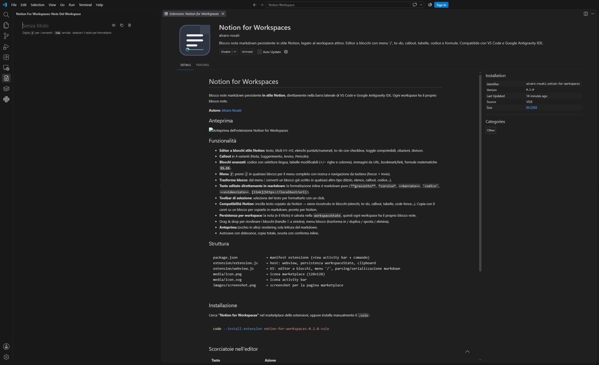

# Notes For Workspaces

**Your notes live where your code lives.**

A Notion-style markdown notepad that lives in your editor's sidebar. Every workspace gets its own note — open a project, and your notes for that project are right there. No switching apps, no browser tabs, no lost sticky notes.

## Why it was made

Great ideas rarely arrive while you're in a note-taking app — they arrive while you're coding. Until now, capturing them meant alt-tabbing to Notion, a browser tab, or a random `.txt` file lost somewhere in your project.

**Notes For Workspaces** gives you one clean place to think, plan and jot things down — without ever leaving the editor. And because each note is bound to its workspace, your thoughts stay organized by project, automatically.

## What you can do

- **Type `/` for everything** — just like in Notion. Headings, lists, to-dos, quotes, callouts, code blocks, tables, math and more, all from one menu.
- **Real blocks, not a plain text file.** Collapsible toggles, checkable to-dos, color-coded callouts, editable tables, code blocks with language picker.
- **Write in markdown, directly.** Bold with `**bold**`, links with `[text](url)`, or just select text and use the floating toolbar.
- **Copy & paste with Notion.** Paste text from Notion and it turns into proper blocks. Copy a block back and it's clean markdown, ready for Notion or anywhere else.
- **Your note never leaves your machine.** Notes are stored locally with your workspace — nothing is uploaded, no account needed.
- **Works with VS Code and VS Code-based editors**, including Google Antigravity IDE, Windsurf and Cursor.

## Getting started

1. Click the **Notes For Workspaces** icon in the activity bar (left side).
2. Start typing — or press `/` to pick a block type.
3. That's it. Your note is saved automatically and will be there next time you open this workspace.

## The `/` menu

| Block | What it's for |
|---|---|
| Text, Heading 1–3 | Structure your note |
| Bulleted / numbered list | Quick lists |
| To-do | Checkable tasks with strikethrough when done |
| Toggle | Collapsible sections — perfect for hiding details |
| Quote | Call out a citation |
| Callout (Note · Tip · Warning · Danger) | Highlighted info boxes |
| Code | Syntax language picker, monospace block |
| Table | Add/remove rows and columns inline |
| Math | Formulas (`$$ … $$`) |
| Image | Embed from URL |
| Bookmark | A titled link card |
| Divider | Separate sections |

## Handy shortcuts

| Keys | Action |
|---|---|
| `/` | Open the block menu |
| `Enter` | New block (lists continue automatically) |
| `Tab` / `Shift+Tab` | Indent / unindent |
| `Ctrl+C` (no selection) | Copy the whole block as markdown |
| `Ctrl+X` (no selection) | Cut the whole block |
| `↑` / `↓` at block edges | Jump between blocks |
| Drag `⋮⋮` handle | Reorder blocks |
| Click `⋮⋮` handle | Transform, duplicate, move or delete |

## Feedback & support

Questions, ideas or issues? [Get in touch](https://sites.google.com/view/alvaro-rosati).

---

**Made by [Alvaro Rosati](https://sites.google.com/view/alvaro-rosati)** · [MIT License](LICENSE)
